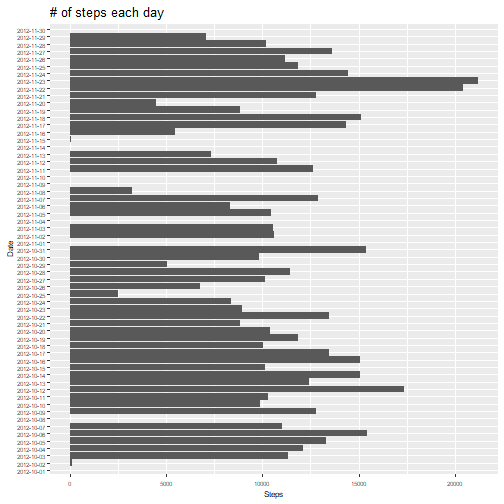
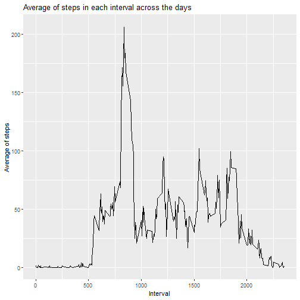
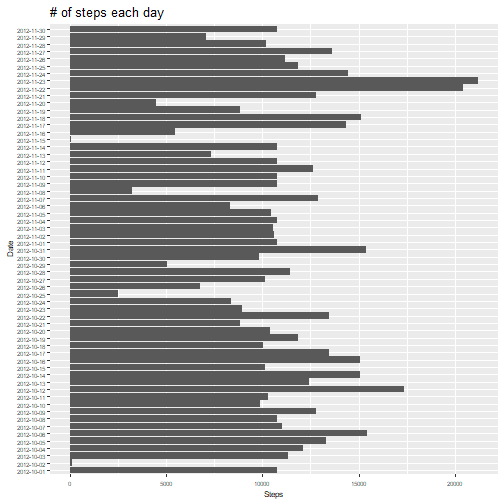
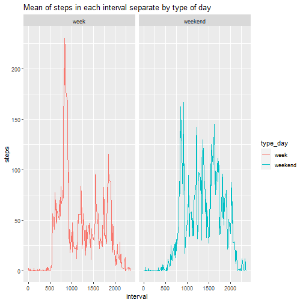

In this R markdown I'm going to work with the [Activity Monitoring Data](https://d396qusza40orc.cloudfront.net/repdata%2Fdata%2Factivity.zip)

First of all, we need to create the folder *data* and download the files


```r
library(zip)
# Creating the data folder 
if(!file.exists("./data")) dir.create("./data")

# Downloading the data
nameFile <- "./data/activity_monitoring_data.zip"
if(!file.exists(nameFile)){
      fileUrl <- paste("https://d396qusza40orc.cloudfront.net/", 
                       "repdata%2Fdata%2Factivity.zip", sep = "")
      download.file(fileUrl, nameFile)
      unzip(nameFile, exdir = "./data")
}
```

Then, we can read the file and explore the data, the file that we unzipped before is called *activity.csv*


```r
activity <- read.csv("./data/activity.csv")
summary(activity)
```

```
##      steps            date              interval     
##  Min.   :  0.00   Length:17568       Min.   :   0.0  
##  1st Qu.:  0.00   Class :character   1st Qu.: 588.8  
##  Median :  0.00   Mode  :character   Median :1177.5  
##  Mean   : 37.38                      Mean   :1177.5  
##  3rd Qu.: 12.00                      3rd Qu.:1766.2  
##  Max.   :806.00                      Max.   :2355.0  
##  NA's   :2304
```

As we can see, we have 3 variables:
1. **steps**: Number of steps in a 5 minute interval
2. **date**: The day of the measurement
3. **interval**: The interval in which measurement was taken 


### What is mean total number of steps taken per day?

We're going to use ggplot to make the histogram of number of steps each day


We're going to group extract the sum of steps each day, then, we extract the mean

```r
library(ggplot2)
ggplot(activity, aes(as.factor(date),steps)) +geom_histogram(stat = "identity") +
      coord_flip() + theme(axis.text = element_text(size = 6)) + 
      theme(axis.title = element_text(size = 8)) + 
      labs(x = "Date", y = "Steps", title = "# of steps each day")
```

```
## Warning: Ignoring unknown parameters: binwidth, bins, pad
```

```
## Warning: Removed 2304 rows containing missing values (position_stack).
```



```r
sum_steps_by_day <- aggregate(steps ~ date, activity, sum) 
mean_steps_days <- mean(sum_steps_by_day$steps, na.rm=T)
```

As we can see, the mean of total steps in one day is 10766.19 steps


## What is the average daily activity pattern?


```r
steps_per_interval <- aggregate(steps ~ interval, activity,  mean)
ggplot(steps_per_interval, aes(interval, steps)) + geom_line() + 
      labs(x = "Interval", y = "Average of steps", 
           title = "Average of steps in each interval across the days")
```



```r
max_interval <- steps_per_interval[which(max(steps_per_interval$steps) == 
                                          steps_per_interval$steps), ]
```

The interval that contain the maximum number of steps is the interval 835


## Imputing missing values

There are some rows with NAs, let's see how many rows contains NAs


```r
incompletes <- sum(!complete.cases(activity))
incompletes_prop <- round(incompletes*100/nrow(activity), 2)
```

There are 2304 rows in the dataset, that mean a 13.11%

For filling this values we gonna use the mean of this interval


```r
mean_steps_by_interval <- aggregate(steps ~ interval, activity, mean)

activity_full <- activity

for(i in seq(1:nrow(activity_full))){
      if(is.na(activity_full[i, "steps"])){
            mean_interval <- mean_steps_by_interval[
                        which(activity_full[i, "interval"] == 
                              mean_steps_by_interval$interval), "steps"]
            
            activity_full[i, "steps"] <- mean_interval
                  
      }
}
```


Adding the information, we gonna plot the steps and see the differences with the
values previously calculated 


```r
ggplot(activity_full, aes(as.factor(date),steps)) +geom_histogram(stat = "identity") +
      coord_flip() + theme(axis.text = element_text(size = 6)) + 
      theme(axis.title = element_text(size = 8)) + 
      labs(x = "Date", y = "Steps", title = "# of steps each day")
```

```
## Warning: Ignoring unknown parameters: binwidth, bins, pad
```




Showing the summary of both data sets 


```r
sum_steps_by_day_full <- aggregate(steps ~ date, activity_full, sum)
summary(sum_steps_by_day$steps)
```

```
##    Min. 1st Qu.  Median    Mean 3rd Qu.    Max. 
##      41    8841   10765   10766   13294   21194
```

```r
summary(sum_steps_by_day_full$steps)
```

```
##    Min. 1st Qu.  Median    Mean 3rd Qu.    Max. 
##      41    9819   10766   10766   12811   21194
```
We can see that the first and the quartile change the value, but the median is pretty similar, and the mean is the same. 

We have to choose wisely the form of input data in the dataset, because we could
ruin the investigation if we put wrong data. 


## Are there differences in activity patterns between weekdays and weekends?

We're going to make a factor variable with 2 levels: week or weekend, 
with this, we plot the time series of intervals


```r
library(dplyr)

# Changing the type of the column date
activity_full <- mutate(activity_full, date = as.Date(date, format = "%Y-%m-%d"))


# function to convert a day in week or weekend 
convertWeekWeekend <- function(day){
      type <- NULL
      if(day %in% c("sábado", "domingo"))
            type <- "weekend"
      else
            type <- "week"
      type
}

# Creating the vector with week or weekend
week_or_weekend <- sapply(weekdays(activity_full$date), convertWeekWeekend)

#Adding the factor column
activity_full <- activity_full %>%
      mutate(week.or.weekend = as.factor(week_or_weekend)) %>%
      group_by(week.or.weekend)


#Split by the type of day
split_activity <- split(activity_full, activity_full$week.or.weekend)

# Obtaining the mean of each interval for the two types
steps_interval_week <- aggregate(steps ~ interval, 
                                 split_activity$week, mean)

steps_interval_week <- mutate(steps_interval_week,
                              type_day = 
                                 rep("week", nrow(steps_interval_week)))


steps_interval_weekend <- aggregate(steps ~ interval, 
                                      split_activity$weekend, mean)

steps_interval_weekend <- mutate(steps_interval_weekend, 
                                 type_day = 
                                    rep("weekend", nrow(steps_interval_weekend)))


# Merging all again
activity_by_type_day <- merge(steps_interval_week, steps_interval_weekend,
                              all = T)


# Plotting 
ggplot(activity_by_type_day, aes(interval, steps, col = type_day)) + 
   geom_line() + facet_grid(.~type_day) + 
   labs(title = "Mean of steps in each interval separate by type of day")
```



As we can see, there are several differences between week and weekend, in week
the activity are more concentrated in one point, and, in weekend, there are 
more regular steps in each interval. 
